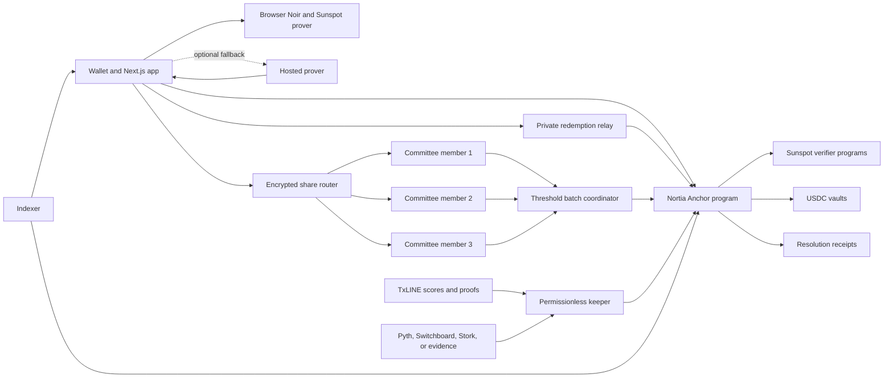

<p align="center">
  
</p>

<h1 align="center">Nortia</h1>

<p align="center">
  <b>Shielded prediction pools and verifiable binary markets on Solana.</b>
</p>

<p align="center">
  <a href="https://nortia-nu.vercel.app/">Live app</a>
  &middot;
  <a href="https://github.com/HoomanBuilds/nortia">GitHub</a>
  &middot;
  <a href="https://explorer.solana.com/address/4S2EvdGrbKJ9zazvB4gtR83crTrVJWqqwoVVvEQy8VE9?cluster=devnet">Devnet program</a>
  &middot;
  <a href="deployments/devnet.json">Deployment record</a>
</p>

Nortia is a prediction-market protocol with two complementary market designs:

- Private fixed-ticket pools where an individual YES or NO side is hidden behind a Poseidon commitment, verified by Noir proofs, shared across a 2-of-3 committee, and settled from TxLINE data.
- Public continuous markets with deterministic binary LMSR pricing, creator-funded liquidity, category-specific resolvers, and immutable settlement receipts.

Both designs escrow Circle devnet USDC in program-owned vaults. SOL is used only for Solana transaction fees and account rent.

Nortia is currently an unaudited devnet beta. Do not use it with real funds.

## Current product

- Private one-USDC sports positions with hidden YES or NO sides
- Browser-generated Noir placement and redemption proofs compiled through Sunspot
- Onchain proof verification through dedicated Solana verifier programs
- Poseidon commitments, Merkle membership proofs, and market-scoped nullifiers
- Three-member Shamir committee with a two-member settlement quorum
- TxLINE score ingestion and permissionless settlement through `validate_stat_v2` CPI
- Deterministic binary LMSR markets with exact integer-only pricing
- Pyth, Switchboard, Stork, TxLINE, and bonded optimistic resolver paths
- User-created market metadata with immutable question, rule, label, and resolver hashes
- USDC escrow, bounded fees, winner claims, timeout recovery, and fee-free refunds
- Wallet-backed Next.js application, indexer, keeper, optional hosted prover, private relay, and committee services

## Two market modes

| | Private TxLINE pool | Public LMSR market |
| --- | --- | --- |
| Position | Fixed 1 USDC ticket | Variable YES or NO shares |
| Side visibility | Hidden from public chain observers | Public |
| Price | Pool payout known after aggregate settlement | Continuous LMSR quote |
| Liquidity | Ticket pool | Creator-funded worst-case subsidy |
| Resolution | TxLINE score proof and CPI | TxLINE, Pyth, Switchboard, Stork, or optimistic evidence |
| Claim | Zero-knowledge redemption proof | Wallet-owned position settlement |
| Fee | 1% of the successful gross pool | Probability-sensitive fill fee, bounded by market configuration |
| Failure path | Full ticket refund | Invalid resolution or timeout settlement |

Private pools are for confidential participation. Public LMSR markets are for continuous price discovery across sports, crypto, economics, politics, science, governance, and other objective binary questions.

## Privacy model

Within the onchain protocol, an individual private-pool side is shielded. The transaction, order account, program events, and USDC transfer do not contain a plaintext YES or NO value.

### What is public

- The payer wallet and one-USDC transfer
- The market, order index, and timing
- The Poseidon order commitment
- Three salted share commitments
- The placement proof and its public inputs
- Aggregate YES and NO counts after batching
- The final outcome, pool accounting, and settlement evidence
- A claim nullifier hash and its recipient wallet

### What remains private

- The individual YES or NO side
- The order secret and nullifier preimage
- The random Shamir coefficient
- Each committee share outside its assigned member service
- The direct link between an order commitment and a later winning claim

### Trust boundaries

| Actor | Privacy property |
| --- | --- |
| Public chain observer | Cannot derive an individual side from the order transaction or link a proof-based claim to one order |
| One committee member | Holds one randomized share and cannot reconstruct the side alone |
| Two colluding committee members | Can reconstruct individual sides because the current threshold is 2-of-3 |
| Browser prover | Generates the witness and proof locally without sending private inputs to Nortia services |
| Optional hosted prover | Sees the side, secret, nullifier, and Shamir witness when explicitly enabled as a fallback |
| Web routing layer | Routes member-specific encrypted envelopes and can observe request metadata, but cannot decrypt a committee share |
| Private relay | Receives public proof material and the selected recipient, and can observe request metadata and timing |
| Local browser storage | Holds an AES-GCM encrypted, wallet-bound recovery vault required for redemption |

Browser proving is the default. The hosted devnet prover is available only when `NEXT_PUBLIC_NORTIA_PROOF_MODE=hosted` is configured, deletes temporary proving workspaces, and remains a trusted witness boundary in that mode. Production privacy still requires independently operated committee members, an audited setup, an audited client, and stronger network-level metadata protection.

The current committee reconstructs aggregate counts by design. The program accepts only batches with at least four orders and at least one order on each side. Ineligible markets remain open until anyone starts the full-value refund path, so their side counts are never written onchain. Aggregate counts in an eligible batch can still narrow anonymity. Nortia therefore provides shielded onchain positions, not an unconditional anonymity claim against committee collusion or metadata analysis.

## Private pool lifecycle

### 1. Prepare

The browser generates a random nonzero secret, nullifier, Shamir coefficient, and three nonzero salts with rejection-sampled Web Crypto entropy. It derives the payer hash and three member shares, then generates the proof locally. The placement circuit proves:

- The hidden side is binary.
- The public order commitment binds the market, ticket amount, side, secret, and nullifier.
- All three public share commitments bind consistent shares of the same side.
- The proof is bound to the transaction payer.

The browser saves the recovery record into a wallet-signature-derived AES-GCM vault before asking the wallet to sign the placement transaction.

### 2. Place

The Nortia program verifies the 324-byte Sunspot proof through the deployed placement-verifier program. A successful transaction creates the order PDA and moves exactly one six-decimal devnet USDC ticket into the market vault.

The side, secret, nullifier, coefficient, and raw shares are never written onchain.

### 3. Deliver committee shares

The browser encrypts each share to its assigned committee member with RSA-OAEP and AES-256-GCM. The web route can route the three ciphertext envelopes but cannot decrypt them. Before accepting a decrypted share, every member verifies:

- The order PDA exists and belongs to Nortia.
- The market, order index, and commitment match.
- Its salted share matches the corresponding onchain share commitment.
- The supplied placement transaction succeeded and invoked the Nortia program.

Member state is encrypted with AES-256-GCM and persisted with owner-only file permissions. Share delivery is idempotent, and an interrupted delivery remains recoverable from the encrypted browser vault until all three members accept it.

### 4. Aggregate

After the lock time, two distinct committee members combine their ordered snapshots. The coordinator adds shares before interpolation, reconstructs the aggregate YES count, derives the NO count, builds the Poseidon commitment root, and submits the batch with two committee signatures.

The program rejects missing orders, fewer than four orders, one-sided batches, mismatched counts, invalid committee signers, early batches, and batches after the deadline. Rejected aggregate counts are not persisted or emitted. After the batch deadline, anyone can enter refunds.

### 5. Resolve with TxLINE

The keeper selects a finalized TxLINE score record and requests the stat-validation payload. Nortia checks the exact fixture, final-period goal keys, timestamps, daily-root PDA, pinned TxLINE program, and CPI return origin before accepting the result.

The program stores the final score, aggregate counts, fee accounting, root account, sequence, and settlement-evidence hash.

### 6. Redeem or refund

A winner proves that a hidden commitment:

- Belongs to the finalized 16-level commitment tree
- Matches the resolved outcome
- Produces the submitted market-scoped nullifier
- Is bound to the selected recipient and exact payout

The claim PDA prevents replay without revealing which order was redeemed. The browser binds the proof to a fresh recipient address that must differ from the order wallet, then sends only the public proof material through the private relay. The relay creates the recipient token account when needed and submits the Solana transaction, so the original wallet is not the onchain redemption sender.

The encrypted recovery vault can be exported and imported as an authenticated wallet-bound backup. The same wallet must sign the vault-unlock message to decrypt it.

If batching or resolution misses its deadline, anyone can open refunds. Every order receives the full one-USDC ticket and no protocol fee is charged.

## Public LMSR lifecycle

### 1. Create

A connected creator selects a category, binary question, exact rules, outcome labels, lock time, resolution policy, and one enabled resolver. The program stores immutable hashes and creates the market, metadata, oracle configuration, USDC vault, and liquidity-owner relationship.

The creator funds:

```text
required subsidy = ceil(b * ln(2)) + rounding reserve
```

This bounds the binary market maker's worst-case loss before trading begins.

### 2. Trade

Nortia uses the binary LMSR cost function:

```text
C(q_yes, q_no) = b * ln(exp(q_yes / b) + exp(q_no / b))
```

The onchain implementation uses deterministic fixed-point integer arithmetic. It does not use settlement-critical floating point. Every buy or sell includes:

- An exact share amount
- A transaction deadline
- A maximum buy cost or minimum sell return
- A bounded market-imbalance check
- A vault-solvency check

The same integer implementation exists in the client package and is tested against independent floating-point references and randomized solvency sequences.

### 3. Resolve

Trading closes at the immutable lock timestamp. A keeper or any eligible caller submits resolver-specific evidence. The program normalizes that evidence into one outcome and writes an immutable resolution receipt.

### 4. Settle

A winning share pays one USDC. An invalid result pays half of the aggregate YES and NO shares, rounded down. The liquidity owner can withdraw only collateral above all unsettled trader liabilities.

## Fees

### Private pools

The canonical private protocol charges 100 basis points, or 1%, once on a successfully resolved gross pool.

```text
gross pool = order count * 1 USDC
protocol fee = floor(gross pool * 1%)
net pool = gross pool - protocol fee
winner payout = floor(net pool / winner count)
```

Ten percent of the protocol fee rewards the resolving keeper. Ninety percent goes to the Nortia treasury. Any division remainder goes to the final valid claim so the vault closes exactly.

Refunds are fee-free. The protocol does not charge an order merely for being placed.

### Public LMSR markets

The canonical engine uses a 100-basis-point configured fill-fee parameter. Its effective fee is probability-sensitive and remains below that configured bound. Seventy percent of collected trading fees goes to the Nortia treasury and thirty percent remains with the market liquidity owner.

The program checks liability coverage after every value-moving instruction. Fees cannot be withdrawn from collateral needed to pay the largest possible outcome.

## Resolver policy

| Resolver | Intended markets | Current state | Onchain validation |
| --- | --- | --- | --- |
| TxLINE `validate_stat_v2` | Sports results and deterministic props | Active on devnet | Fixture, final period, stat keys, daily root, program ID, CPI return source, and time window |
| Pyth `PriceUpdateV2` | Crypto and economic price thresholds | Active and exercised on devnet | Receiver owner, verification level, feed ID, observation interval, publish lag, and confidence width |
| Pyth push oracle | Sponsored push-feed price markets | Enabled in program | Pinned push-oracle program and canonical feed identity |
| Switchboard canonical quote | Curated numeric facts outside sports and crypto | Built and tested | Quote program, devnet queue, canonical PDA, feed hash, sample count, and slot age |
| Stork price | Crypto and economic price thresholds | Built and tested, API access not configured on the live operator | Canonical feed PDA, owner, discriminator, asset ID, timestamp, and fixed exponent |
| Bonded optimistic | Politics, governance, launches, awards, and long-tail facts | Built and tested | Evidence hashes, equal opposing bonds, challenge window, committee dispute path, and timeout |
| UMA over Wormhole | Future long-tail arbitration | Disabled | Market creation fails closed |
| Chainlink report | Future report-based markets | Disabled | Market creation fails closed |

Unsupported resolvers cannot create an open market. A market cannot switch resolver, feed, rules, labels, fee split, or observation policy after creation.

## Provider profiles

Devnet defaults to credential-free public infrastructure:

```dotenv
ORACLE_PROVIDER_PROFILE=free
```

Free mode pins public Pyth Hermes and Switchboard Crossbar, removes accidentally supplied Pyth credentials, and paces Hermes requests. The Stork program adapter remains compiled, but offchain Stork fetching stays unavailable without an API token.

Managed provider access can be enabled without changing program code:

```dotenv
ORACLE_PROVIDER_PROFILE=managed
PYTH_API_KEY=replace-me
PYTH_HERMES_ORIGIN=https://managed-provider.example/hermes
SWITCHBOARD_CROSSBAR_ORIGIN=https://managed-provider.example/crossbar
STORK_REST_ORIGIN=https://managed-provider.example/stork
STORK_API_TOKEN=replace-me
```

Provider selection never relaxes the onchain program, feed, queue, timestamp, confidence, sample, or canonical-account checks.

## TxLINE integration

TxLINE is Nortia's primary sports data source. The integration is implemented in [the TxLINE client](services/src/txline/client.ts), [validation mapper](services/src/txline/validation.ts), and [onchain CPI adapter](programs/nortia/src/txline.rs).

Endpoints used:

- `GET /scores/historical/{fixtureId}` for final-record discovery and replay
- `GET /scores/snapshot/{fixtureId}?asOf=...` for current fixture state
- `GET /scores/updates/{epochDay}/{hourOfDay}/{interval}?fixtureId=...` for bounded recovery scans
- `GET /scores/stream` for live SSE ingestion
- `GET /scores/stat-validation?fixtureId=...&seq=...&statKeys=1,2` for the Merkle payload submitted to settlement CPI

Nortia accepts only a finalized game record with status `100`, a positive sequence, and final period `100` when the record exposes a period field. Score validation separately requires both proven goal leaves to use the final period.

Integration notes:

- TxLINE's normalized score schema supports one adapter across the full tournament.
- Historical, snapshot, bounded-update, and SSE interfaces provide both live ingestion and recovery.
- The stat-validation endpoint maps directly to deterministic market predicates.
- Response casing is normalized across `Seq` and `seq`.
- Authenticated historical responses may arrive as SSE records even with an application-JSON accept header.
- A final historical record may omit its top-level period while the stat proof still binds both goal leaves to period `100`.

## Architecture



### Repository layout

| Path | Responsibility |
| --- | --- |
| [`programs/nortia/`](programs/nortia) | Anchor program, private pools, LMSR engine, resolvers, receipts, positions, and vault accounting |
| [`circuits/`](circuits) | Noir placement and redemption circuits, browser prover wrapper, and generated verifier sources |
| [`client/`](client) | Exact LMSR math, Poseidon commitments, Merkle trees, Shamir aggregation, oracle inputs, and portfolio math |
| [`services/src/prover/`](services/src/prover) | Optional authenticated hosted proof-generation fallback |
| [`services/src/committee/`](services/src/committee) | Three encrypted share services and the two-member batch coordinator |
| [`services/src/relayer/`](services/src/relayer) | Authenticated redemption relay for fresh recipient addresses |
| [`services/src/keeper/`](services/src/keeper) | Market locks, resolver settlement, optimistic finalization, and timeout recovery |
| [`services/src/indexer/`](services/src/indexer) | Account snapshots, metadata verification, position state, and resolution receipts |
| [`services/src/txline/`](services/src/txline) | TxLINE REST, SSE, final-record selection, and validation-payload mapping |
| [`services/src/pyth/`](services/src/pyth) | Timestamped Hermes retrieval and Pyth settlement composition |
| [`services/src/switchboard/`](services/src/switchboard) | Canonical quote definition and validation |
| [`services/src/stork/`](services/src/stork) | Authenticated price retrieval and canonical feed settlement |
| [`web/`](web) | Next.js landing page and wallet-backed market application |
| [`deployments/`](deployments) | Canonical devnet addresses, transactions, artifacts, and runtime configuration |

Root Cargo files and `programs/` follow the standard Anchor workspace structure. JavaScript dependencies remain isolated under `client/`, `services/`, and `web/`.

## Devnet deployment

The canonical record is [deployments/devnet.json](deployments/devnet.json).

| Component | Solana devnet address |
| --- | --- |
| Nortia program | [`4S2EvdGrbKJ9zazvB4gtR83crTrVJWqqwoVVvEQy8VE9`](https://explorer.solana.com/address/4S2EvdGrbKJ9zazvB4gtR83crTrVJWqqwoVVvEQy8VE9?cluster=devnet) |
| ProgramData | [`38zjkVVYSt6A2ZA5vN4grWH4kwY6GUGM4uzhaugNdZWS`](https://explorer.solana.com/address/38zjkVVYSt6A2ZA5vN4grWH4kwY6GUGM4uzhaugNdZWS?cluster=devnet) |
| Placement verifier | [`DgG5WEALzukX8DWwQNmWMnnpYCWZKFTU3bP8Lmh9UywC`](https://explorer.solana.com/address/DgG5WEALzukX8DWwQNmWMnnpYCWZKFTU3bP8Lmh9UywC?cluster=devnet) |
| Redemption verifier | [`7LT9qPkWPKaijNjfQxGdCSUtd1xVhVc1tCPyEpQrGpqJ`](https://explorer.solana.com/address/7LT9qPkWPKaijNjfQxGdCSUtd1xVhVc1tCPyEpQrGpqJ?cluster=devnet) |
| Protocol PDA | [`CJi67t1hHprwceArXdPyw6xLrN1Y3QbcvSC4R2SXoKZR`](https://explorer.solana.com/address/CJi67t1hHprwceArXdPyw6xLrN1Y3QbcvSC4R2SXoKZR?cluster=devnet) |
| Market engine PDA | [`EWgvZgWZNc1m2yunKonZwavnPgY6n6T2BbwXFC6kdRpf`](https://explorer.solana.com/address/EWgvZgWZNc1m2yunKonZwavnPgY6n6T2BbwXFC6kdRpf?cluster=devnet) |
| Circle devnet USDC | [`4zMMC9srt5Ri5X14GAgXhaHii3GnPAEERYPJgZJDncDU`](https://explorer.solana.com/address/4zMMC9srt5Ri5X14GAgXhaHii3GnPAEERYPJgZJDncDU?cluster=devnet) |
| TxLINE program | [`6pW64gN1s2uqjHkn1unFeEjAwJkPGHoppGvS715wyP2J`](https://explorer.solana.com/address/6pW64gN1s2uqjHkn1unFeEjAwJkPGHoppGvS715wyP2J?cluster=devnet) |
| Private replay market | [`44cD1kbvuheo5wSM4gxEZvAfitAXbC25f2u4Mzs48qix`](https://explorer.solana.com/address/44cD1kbvuheo5wSM4gxEZvAfitAXbC25f2u4Mzs48qix?cluster=devnet) |
| Private replay vault | [`EqjB6nuMcvhtTw9Cngs2EgSNjthC6VrxFDthZnoYxtyM`](https://explorer.solana.com/address/EqjB6nuMcvhtTw9Cngs2EgSNjthC6VrxFDthZnoYxtyM?cluster=devnet) |
| Canonical Pyth market | [`Gwg5Q44JVakT3JdNtpJQPeSCCDas4VFJpeY2zmzXQ34h`](https://explorer.solana.com/address/Gwg5Q44JVakT3JdNtpJQPeSCCDas4VFJpeY2zmzXQ34h?cluster=devnet) |
| Canonical Pyth vault | [`3A3sQJ1V5g1tX5xy2P6zh72qXjPVH7T6Wupb74siEvGy`](https://explorer.solana.com/address/3A3sQJ1V5g1tX5xy2P6zh72qXjPVH7T6Wupb74siEvGy?cluster=devnet) |

The current Nortia binary was confirmed at slot `477890681` with transaction [`4mySwWKMgxi7N2b9obVVLdjkDWqz4A2WgLUDv49PQuVSZFULH8ehppQWPbYk4mBeYjVFdpr7v94BM3SA4jAZYUbG`](https://explorer.solana.com/tx/4mySwWKMgxi7N2b9obVVLdjkDWqz4A2WgLUDv49PQuVSZFULH8ehppQWPbYk4mBeYjVFdpr7v94BM3SA4jAZYUbG?cluster=devnet).

The table records the currently live devnet state. This source tree contains a pending hardened verifier pair at `AJwBUyb2GP5MejGz22Tk88GX9FdVFVcJvFMUU9EtqLjH` and `5LcBMGtMj2VAUFhQgRqPvJwRS9Z28Emv7rSWYcgBEPGZ`. Private browser proofs from this branch are not compatible with the live verifier pair until those programs, the Nortia program, protocol configuration, and empty replay market are rotated together. Public LMSR operation is unaffected.

The web application is deployed on Vercel. The optional prover, indexer, keeper, relay, and three committee members run as isolated services. Private service access is token-protected, bounded, and exposed through narrow no-store proxy routes. The current bootstrap deployment runs the committee members under one operator, so process isolation does not provide independence from operator collusion.

## Local development

Requirements:

- Node.js 22 or newer
- Rust 1.89 or newer
- Solana CLI configured for devnet
- Anchor CLI 1.0.0
- Noir `1.0.0-beta.22`
- Sunspot `v1.0.0`

Install the three workspaces:

```bash
npm --prefix client install
npm --prefix services install
npm --prefix web install
```

Create local environment files:

```bash
cp services/.env.example services/.env
cp web/.env.example web/.env.local
```

Generate Nortia-only local keys without overwriting TxLINE credentials:

```bash
NORTIA_KEYPAIR_PATH=/absolute/path/to/devnet-keypair.json \
node scripts/bootstrap-local-env.mjs
```

Start the web application:

```bash
npm --prefix web run dev
```

Run backend processes in separate terminals:

```bash
npm --prefix services run prover
npm --prefix services run committee
npm --prefix services run relayer
npm --prefix services run indexer
npm --prefix services run keeper
```

Each committee member needs its own `COMMITTEE_MEMBER_INDEX`, port, state path, and RSA encryption key file. Generate each file once with:

```bash
npm --prefix services run committee:keys -- 1 /absolute/path/to/committee-1-encryption.json
```

Set `COMMITTEE_ENCRYPTION_KEY_PATH` to the matching file and give each member a distinct 32-byte hex `COMMITTEE_STATE_KEY` to encrypt its state. Batch coordination additionally requires two member endpoints and two committee signer keypairs.

The relay needs a dedicated funded devnet signer at `NORTIA_RELAYER_KEYPAIR_PATH`, a private `RELAYER_API_TOKEN`, and its own `RELAYER_PORT`. Configure `NORTIA_RELAYER_URL` and `NORTIA_RELAYER_API_TOKEN` only in the Vercel server environment. Keep `NEXT_PUBLIC_NORTIA_PROOF_MODE` unset for browser proving. Set it to `hosted` only when the explicit hosted fallback is required.

The keeper defaults to dry-run. Set `KEEPER_DRY_RUN=false` only for a deliberately funded devnet keeper.

## Verification

```bash
cargo fmt --check
cargo clippy -p nortia --all-targets -- -D warnings
cargo test -p nortia
anchor build --ignore-keys
npm --prefix client test
npm --prefix client run typecheck
npm --prefix services test
npm --prefix services run typecheck
npm --prefix web run typecheck
npm --prefix web run build
```

Circuit checks:

```bash
cd circuits
nargo test --workspace
nargo compile --workspace
```

Latest verified results:

- 73 Rust tests pass.
- 47 client assertions pass.
- 53 service assertions pass.
- The Noir placement suite passes 4 tests across 3,918 constraints.
- The Noir redemption suite passes 3 tests across 20,737 constraints.
- Clippy passes with warnings denied.
- Anchor produces a valid SBF artifact.
- The optimized Next.js production build passes.
- A signed private-placement simulation verifies the proof and full order path in 215,237 of 300,000 requested compute units.
- A signed redemption-verifier simulation succeeds in 190,485 of 300,000 requested compute units.
- The browser WASM prover generates 324-byte placement and redemption proofs with 236-byte public witnesses, and both verify against the exact generated native verification keys.
- Browser ACIR, constraint-system, and proving-key artifacts match the generated circuit artifacts byte for byte.

Run `cargo clean` after Rust verification when local disk space is constrained.

## Security status

Nortia is experimental and unaudited.

- The Solana program, integer LMSR implementation, oracle adapters, circuits, and generated verifier programs require independent review.
- Sunspot setup artifacts were generated with a development trusted setup. Mainnet requires an independent ceremony.
- The program remains upgradeable by the recorded devnet upgrade authority.
- Browser proving keeps private witnesses in the client by default. The explicitly enabled hosted fallback sees private witnesses.
- The current committee is a fixed 2-of-3 set running under one devnet operator. Two members, or that operator, can reconstruct individual sides despite encrypted transport and encrypted state.
- Eligible batches publish aggregate counts, which can narrow anonymity even with the four-order and two-sided minimum.
- The routing layer and relay can observe IP addresses, timing, market selection, and recipient metadata. Nortia does not currently provide Tor routing or independent relay selection.
- Recovery secrets are encrypted in browser local storage and can be exported as a wallet-bound backup. Losing every copy can make a private position unclaimable.
- Public LMSR trades are intentionally transparent and must not be described as private.
- TxLINE settlement verifies the pinned onchain validation program and Merkle path, but still inherits the data-source trust assumptions of TxLINE.
- Keepers improve availability but hold no exclusive settlement authority. Nothing onchain executes automatically without a transaction.
- No mainnet deployment should occur before an audit, independent committee operation, production monitoring, setup review, privacy-set policy, and legal review.

Prediction-market operation must comply with applicable gambling, gaming, financial, consumer-protection, securities, privacy, and data laws.
