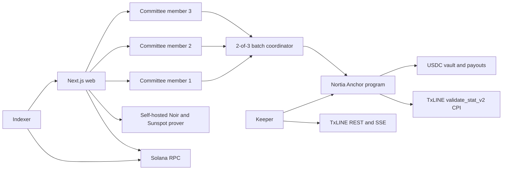

# Nortia

Nortia is a private, resolver-backed prediction market protocol on Solana. Users enter fixed-ticket USDC pools, keep their YES or NO side hidden behind a Noir proof, and settle against an explicit onchain evidence adapter.

TxLINE sports is the first connected adapter. The same market, escrow, fee, claim, and refund core is designed to support reviewed price, governance, public-data, and optimistic-resolution adapters later. Unsupported categories are visible as product taxonomy but cannot accept collateral.

## Why it matters

Most sports markets ask users to trust both the venue and the result operator. Nortia separates those responsibilities:

- The Anchor program owns USDC escrow and enforces every deadline and phase.
- Noir proves that a ticket and its committee shares encode one valid hidden binary side.
- A 2-of-3 committee reveals only aggregate YES and NO counts after trading locks.
- TxLINE supplies the final sports record and Merkle proof.
- Nortia performs a CPI into TxLINE's devnet validator before changing the outcome or moving fees.
- Winners redeem with a market-scoped nullifier proof. Timeout and one-sided pools refund the complete ticket.

## Product flow

1. A creator selects a TxLINE-covered fixture, supported condition, and timing.
2. The wallet creates a creator-namespaced market PDA using protocol-pinned security configuration.
3. A trader selects YES or NO and the self-hosted prover generates the placement proof.
4. The browser saves the recovery record locally before asking the wallet to sign.
5. The program verifies the proof and escrows exactly 1 USDC.
6. Each committee member receives and validates only its own share after the order confirms.
7. At lock, two committee members reconstruct aggregate counts and co-sign the batch.
8. The keeper retrieves the real `game_finalised` record and V2 stat-validation payload from TxLINE.
9. The program validates participant goal keys `1` and `2`, final period `100`, and the daily TxLINE root through CPI.
10. Winners claim with a redeem proof, or original payers refund if the market enters `Refunding`.

The web also includes a wallet-free deterministic replay for fixture `18222446`, Argentina 3-1 Switzerland. Fixture and result metadata come from TxLINE's covered World Cup schedule. Replay event timing is explicitly labeled as simulated and is never presented as live feed data or a devnet transaction.

## Architecture



```text
programs/nortia/    Anchor escrow, lifecycle, fee, settlement, claim, and refund core
circuits/           Noir placement and redeem circuits
client/             Poseidon commitments, Shamir batching, Merkle trees, and economics
services/txline/    Authenticated TxLINE REST, SSE, and proof mapping
services/committee/ Independent member service and 2-of-3 coordinator
services/keeper/    Deadline, settlement, and refund automation
services/indexer/   Normalized onchain market snapshot
services/prover/    Self-hosted Nargo and Sunspot execution boundary
web/                Next.js landing page and wallet-backed market application
deployments/        Canonical network status and confirmed transaction evidence
docs/               Product specs, security assumptions, and execution plans
```

`programs/` and the root Cargo files follow Anchor's standard workspace layout. JavaScript manifests are intentionally scoped to `web/`, `client/`, and `services/`.

## State machine

| State | Orders | Maintenance | Exit |
| --- | --- | --- | --- |
| Open before `lock_ts` | Enabled | Read and index | Lock time |
| Open after `lock_ts` | Disabled | Submit committee batch | Batched or Refunding |
| Batched | Disabled | Submit final TxLINE proof | Resolved or Refunding |
| Resolved | Disabled | Winners redeem | Closed |
| Refunding | Disabled | Original payers refund | Closed |
| Closed | Disabled | Receipt only | Terminal |

Every gate is enforced by the program. The UI derives the same state and never exposes a live order action after lock.

## Economics

- Collateral: six-decimal Solana devnet USDC.
- Ticket: fixed at `1_000_000` base units, or 1 USDC.
- Success fee: 100 basis points of the gross pool, charged only after a valid settlement.
- Default split: 90% of the fee to Nortia treasury and 10% to the resolving keeper.
- Keeper split cap: 50% of the success fee.
- Refund fee: zero for one-sided batches, missed deadlines, invalid results, and every refund path.
- Payout dust: the last valid winner receives integer-division remainder so the vault can close empty.
- Fee cap: 300 basis points in the program.

For the three-ticket replay, the gross pool is 3.000000 USDC, the success fee is 0.030000, Nortia treasury receives 0.027000, the keeper receives 0.003000, and two winning tickets receive a base payout of 1.485000 each.

## TxLINE integration

Nortia uses the devnet API origin `https://txline-dev.txodds.com/api` and program `6pW64gN1s2uqjHkn1unFeEjAwJkPGHoppGvS715wyP2J`.

Endpoints used:

- `GET /scores/historical/{fixtureId}` for final-record discovery and replay.
- `GET /scores/snapshot/{fixtureId}?asOf=...` for current fixture state.
- `GET /scores/updates/{epochDay}/{hourOfDay}/{interval}?fixtureId=...` for bounded recovery scans.
- `GET /scores/stream` for SSE score ingestion.
- `GET /scores/stat-validation?fixtureId=...&seq=...&statKeys=1,2` for the V2 Merkle payload used by settlement CPI.

The keeper accepts only an observed record with `action=game_finalised`, `statusId=100`, `period=100`, and a positive sequence. The program separately requires final-period stats, the exact fixture, pinned score keys, a correctly derived daily root PDA, and a successful TxLINE CPI return.

## TxLINE feedback

What worked well:

- One normalized score schema makes fixture-wide ingestion much simpler.
- The `statKeys` V2 endpoint maps cleanly to deterministic program predicates.
- Published daily-root PDA rules and runnable devnet examples remove ambiguity from CPI integration.
- Historical, snapshot, bounded updates, and SSE cover both live operation and recovery.

Friction encountered:

- Finality depends on application code choosing the correct observed sequence before requesting a proof. The distinction between a valid in-play proof and a final-settlement proof deserves a dedicated final-record endpoint or typed response.
- Response casing can vary between `Seq` and `seq`, so the adapter normalizes both.
- Coordinating JWT, activated API token, network-specific IDL, API host, and program identity still requires several manual checks. A single network configuration object or official SDK would reduce setup mistakes.

## Local setup

Requirements:

- Node.js 22+
- Rust 1.89 and Anchor CLI compatible with Anchor 1.0.0
- Solana CLI configured for devnet
- Noir `1.0.0-beta.22` and Sunspot `v1.0.0` for live proof generation

Install each workspace:

```bash
npm --prefix client install
npm --prefix services install
npm --prefix web install
```

Copy and populate environment files:

```bash
cp web/.env.example web/.env.local
cp services/.env.example services/.env
```

Start the web application:

```bash
npm --prefix web run dev
```

Run backend processes in separate terminals:

```bash
npm --prefix services run committee
npm --prefix services run committee:batch -- <market-address>
npm --prefix services run prover
npm --prefix services run indexer
npm --prefix services run keeper
```

Run three committee instances with distinct member index, port, state path, and key material. The keeper is dry-run unless `KEEPER_DRY_RUN=false` is set.

## Verification

```bash
cargo test -p nortia
anchor build
npm --prefix client run typecheck
npm --prefix client test
npm --prefix services run typecheck
npm --prefix services test
npm --prefix web run typecheck
npm --prefix web run build
```

Current verified results:

- 14 Rust tests pass.
- Anchor's deploy-target build passes without a stack-frame warning.
- 14 client and privacy tests pass.
- 7 service and TxLINE adapter tests pass.
- Next.js typecheck and optimized production build pass.
- Desktop and real 390px device emulation show a shared 1440px shell with no horizontal overflow.

## Deployment status

The complete protocol stack is live on Solana devnet. The exact machine-readable state is recorded in `deployments/devnet.json`.

| Account | Address |
| --- | --- |
| Nortia program | `4S2EvdGrbKJ9zazvB4gtR83crTrVJWqqwoVVvEQy8VE9` |
| Placement verifier | `6Hbwzfm315jkt1xFgLMbnKxVG6wXMiJH1zTUh2ujzcAt` |
| Redeem verifier | `7PQFWh8XRoGya1fJSM69Rpjcec8cqKJi3e3gVYwwk3YW` |
| Protocol PDA | `CJi67t1hHprwceArXdPyw6xLrN1Y3QbcvSC4R2SXoKZR` |
| Judge replay market | `44cD1kbvuheo5wSM4gxEZvAfitAXbC25f2u4Mzs48qix` |
| Market USDC vault | `EqjB6nuMcvhtTw9Cngs2EgSNjthC6VrxFDthZnoYxtyM` |

The judge replay market is a real program-owned account and remains open through July 27, 2026. The web catalog reads its onchain state every 15 seconds. Its initialization transaction is `DUm3uXtDhfv6DqNfLDQ35cBQGFVxzUU9ajpmuLBDVymdQXoGyvcUFUmyWgfx2H92VpLWZB17zm7YC8xhieZj3Hx`.

To reproduce the program deployment and protocol initialization:

```bash
scripts/deploy-devnet.sh
```

To create or verify the canonical replay market:

```bash
NORTIA_KEYPAIR_PATH=/path/to/authority.json npm --prefix services run deploy:replay-market
```

Sunspot and the generated verifier programs are unaudited. Treat this deployment as devnet-only experimental software.

Never place real-value funds into the replay build. This project is experimental software and prediction-market use must comply with applicable gambling, gaming, financial, consumer-protection, and securities laws.
