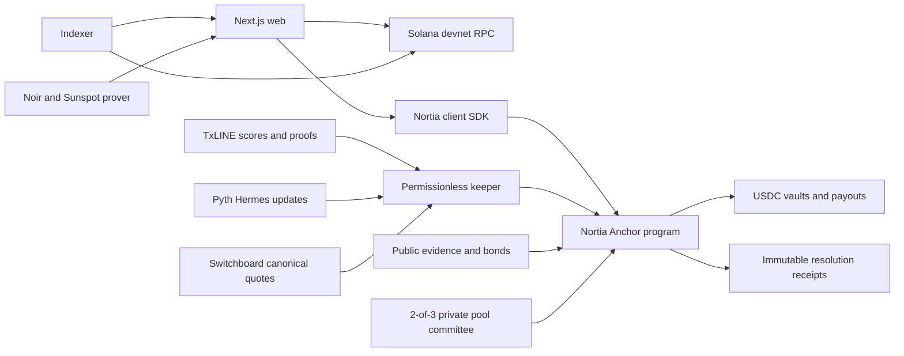

# Nortia

Nortia is a general prediction market protocol on Solana. It combines continuous, collateralized LMSR pricing with category-specific settlement adapters and immutable public resolution receipts.

The product supports two market modes:

- Public LMSR markets for crypto prices and long-tail public facts, with sports and custom numeric adapters at the protocol layer.
- Private fixed-ticket TxLINE sports pools, where Noir proofs hide each YES or NO side until aggregate settlement.

All current deployment work is pinned to Solana devnet and Circle devnet USDC. No real-value asset should be used.

## Current status

| Surface | Status |
| --- | --- |
| Next.js landing page and market application | Working |
| Wallet connection, market creation, trading, portfolio, and claims | Working against the V2 IDL |
| Integer-only binary LMSR program | Built and tested |
| TxLINE V1 private replay | Live on devnet |
| TxLINE V2 resolver | Built and tested |
| Pyth timestamped price resolver | Built and tested |
| Switchboard canonical quote resolver | Built and tested, curated feed provisioning required |
| Bonded optimistic resolver | Built and tested |
| V2 devnet program upgrade | Awaiting additional faucet SOL for program growth and the transient upload buffer |
| UMA over Wormhole and Chainlink report adapters | Disabled until exact verifiers are deployed and tested |

The existing V1 deployment remains usable while the V2 upgrade is pending. The deployment script checks authority, cluster identity, binary capacity, rent, and temporary buffer funding before spending any SOL.

## Product flow

### Public LMSR market

1. A creator selects a reviewed resolver, question, rules, observation time, and binary labels.
2. The program stores immutable hashes and creates the market, oracle configuration, and USDC vault PDAs.
3. The creator deposits `ceil(b * ln(2))` plus the rounding reserve to bound the market maker's worst-case loss.
4. A trader opens one wallet-owned position PDA and buys or sells an exact number of YES or NO shares.
5. Every fill enforces a deadline and an explicit maximum buy or minimum sell amount.
6. Trading closes at `lock_ts`. Calls after that boundary fail even if the UI is stale.
7. A permissionless keeper submits category-appropriate evidence or triggers the timeout fallback.
8. Winning shares pay one USDC each. An invalid result pays half a USDC per aggregate share, rounded down.
9. The liquidity owner can withdraw only collateral above unsettled trader liability.

### Private TxLINE pool

1. A trader commits to a hidden side and receives a Noir placement proof.
2. The program escrows one devnet USDC ticket.
3. A 2-of-3 committee reveals only aggregate YES and NO counts after lock.
4. TxLINE supplies the final World Cup score and Merkle proof.
5. Nortia validates the result through TxLINE CPI before opening winner claims.
6. A market with no valid final proof or no two-sided batch enters fee-free refunds.

The wallet-free replay uses fixture `18222446`, Argentina 3-1 Switzerland. It is visibly labeled as historical simulation and never represented as a live match.

## Architecture



```text
programs/nortia/    V1 private pools and additive V2 LMSR, oracle, receipt, and position state
circuits/           Noir placement and redemption circuits plus generated verifier programs
client/             Exact LMSR math, PDA derivation, oracle inputs, portfolio math, and privacy primitives
services/committee/ Private pool members and batch coordinator
services/indexer/   V1 and V2 account snapshots, metadata verification, and resolution receipts
services/keeper/    Lock, oracle settlement, optimistic finalization, and timeout automation
services/prover/    Self-hosted Nargo and Sunspot execution boundary
services/pyth/      Timestamped Hermes update retrieval and Pyth transaction composition
services/txline/    TxLINE REST, final-record selection, and V2 proof mapping
web/                Next.js landing page and wallet-backed market application
deployments/        Canonical public devnet addresses and transaction evidence
docs/specs/         Product, economics, oracle, security, and integration specifications
docs/plans/         Ordered implementation and deployment plans
```

Root Cargo files and `programs/` follow the Anchor workspace convention. JavaScript packages remain isolated under `web/`, `client/`, and `services/`.

## V2 lifecycle

| Phase | Trading | Permissionless actions | Exit |
| --- | --- | --- | --- |
| Open before lock | Buy and sell | Read, index, publish metadata | Lock time |
| Open after lock | Rejected | Lock market or submit valid resolution evidence | Locked, Resolving, or Resolved |
| Locked | Rejected | Submit machine evidence or optimistic proposal | Resolving or Resolved |
| Resolving | Rejected | Challenge or finalize after liveness | Disputed or Resolved |
| Disputed | Rejected | Committee arbitration or hard timeout | Resolved |
| Resolved | Rejected | Settle positions and withdraw surplus liquidity | Claims complete |
| Closed | Rejected | Receipt only | Terminal |

The program enforces every boundary. UI buttons are derived from the same state and become unavailable at expiration.

## LMSR economics

- Collateral: six-decimal Circle devnet USDC.
- Price model: deterministic binary LMSR with no settlement-critical floating point.
- Creator subsidy: `ceil(b * ln(2))` plus a two-base-unit rounding reserve.
- Default market fee parameter: 100 basis points.
- Fee shape: probability-sensitive per fill, with the highest rate bounded by the market fee parameter.
- Fee split: 70% to the Nortia treasury and 30% to the market liquidity owner.
- Binary payout: one winning share pays one USDC.
- Invalid payout: aggregate YES plus NO shares pay half value, rounded down.
- Solvency: every value-moving instruction checks that the vault covers the largest possible outcome liability.
- Optimistic cap: each binary outcome liability cannot exceed the configured resolver bond.

The legacy private pool retains its separate one-percent successful-pool fee, split 90% to the treasury and 10% to the resolving keeper. Refund paths remain fee-free.

## Resolver policy

| Resolver | Intended markets | Onchain checks |
| --- | --- | --- |
| TxLINE `validate_stat_v2` | World Cup results and deterministic props | Program ID, fixture, final period, stat keys, root PDA, CPI return origin, time window |
| Pyth `PriceUpdateV2` | Timestamped crypto price thresholds | Receiver owner, full verification, feed ID, bracketing interval, publish lag, confidence width |
| Switchboard canonical quote | Finalized custom numeric facts | Quote program, devnet queue, canonical PDA, feed hash, distinct samples, slot age |
| Bonded optimistic | Politics, governance, launches, awards, and long-tail facts | Public evidence URI, role-bound hash, equal opposing bonds, challenge window, committee dispute path |
| UMA over Wormhole | Future long-tail arbitration | Disabled |
| Chainlink report | Future report-based categories | Disabled |

Unsupported resolvers cannot create an open market. A market cannot silently switch adapters after creation.

## Free and managed provider switch

Devnet defaults to public infrastructure:

```dotenv
ORACLE_PROVIDER_PROFILE=free
```

The free profile:

- Pins public Pyth Hermes at `https://hermes.pyth.network`.
- Never forwards an accidentally supplied Pyth API key.
- Paces Hermes requests to stay below the public testing limit.
- Pins public Switchboard Crossbar at `https://crossbar.switchboard.xyz`.

The managed path remains available without changing program code:

```dotenv
ORACLE_PROVIDER_PROFILE=managed
PYTH_API_KEY=replace-me
PYTH_HERMES_ORIGIN=https://managed-provider.example/hermes
SWITCHBOARD_CROSSBAR_ORIGIN=https://managed-provider.example/crossbar
```

Managed mode requires a Pyth key and accepts only credential-free HTTPS origins. Provider selection never relaxes the onchain receiver, feed, queue, timestamp, confidence, sample, or canonical-account checks.

Switchboard market creation is intentionally curated. A canonical quote feed must be provisioned and updated through the official Switchboard instruction bundle before the Nortia keeper consumes it.

## TxLINE integration

Nortia uses TxLINE as the primary sports data source and pins devnet program `6pW64gN1s2uqjHkn1unFeEjAwJkPGHoppGvS715wyP2J`.

Endpoints used:

- `GET /scores/historical/{fixtureId}` for final-record discovery and replay.
- `GET /scores/snapshot/{fixtureId}?asOf=...` for current fixture state.
- `GET /scores/updates/{epochDay}/{hourOfDay}/{interval}?fixtureId=...` for bounded recovery scans.
- `GET /scores/stream` for live SSE ingestion.
- `GET /scores/stat-validation?fixtureId=...&seq=...&statKeys=1,2` for the Merkle payload used by settlement CPI.

The keeper accepts only `game_finalised`, status `100`, final period `100`, and a positive sequence. The program separately verifies the exact fixture, goal keys, timestamp bounds, daily root PDA, pinned TxLINE program, and CPI return.

## TxLINE feedback

What worked well:

- One normalized score schema simplifies tournament-wide ingestion.
- The `statKeys` V2 endpoint maps cleanly to deterministic market predicates.
- Published daily-root PDA rules make CPI integration inspectable.
- Historical, snapshot, bounded updates, and SSE cover live operation and recovery.

Friction encountered:

- Finality still requires application code to select the right observed sequence before requesting a proof.
- Response casing can vary between `Seq` and `seq`, so the adapter normalizes both.
- JWT, API token, host, IDL, and program identity require several coordinated network checks.

## Local setup

Requirements:

- Node.js 22+
- Rust 1.89+
- Anchor CLI 1.0.0
- Solana CLI configured for devnet
- Noir `1.0.0-beta.22` and Sunspot `v1.0.0` for private proof generation

Install the isolated workspaces:

```bash
npm --prefix client install
npm --prefix services install
npm --prefix web install
```

Configure local environments:

```bash
cp web/.env.example web/.env.local
cp services/.env.example services/.env
```

Start the application:

```bash
npm --prefix web run dev
```

Run backend processes in separate terminals as needed:

```bash
npm --prefix services run committee
npm --prefix services run committee:batch -- <market-address>
npm --prefix services run prover
npm --prefix services run indexer
npm --prefix services run keeper
```

The keeper defaults to dry-run. Set `KEEPER_DRY_RUN=false` only for an explicitly funded devnet keeper.

## Verification

```bash
cargo fmt --check
cargo clippy -p nortia --all-targets -- -D warnings
cargo test -p nortia
anchor build
npm --prefix client test
npm --prefix client run typecheck
npm --prefix services test
npm --prefix services run typecheck
npm --prefix web run typecheck
npm --prefix web run build
```

Current verified results:

- 61 Rust tests pass.
- 38 client tests pass.
- 34 service tests pass.
- Clippy passes with warnings denied.
- Anchor produces a valid SBF artifact.
- Next.js typecheck and optimized production build pass.
- Desktop and true 390px device emulation pass without page-level horizontal overflow.

## Deployment

The V1 private TxLINE stack is live on Solana devnet. Public evidence is stored in `deployments/devnet.json`.

| Account | Address |
| --- | --- |
| Nortia program | `4S2EvdGrbKJ9zazvB4gtR83crTrVJWqqwoVVvEQy8VE9` |
| Placement verifier | `6Hbwzfm315jkt1xFgLMbnKxVG6wXMiJH1zTUh2ujzcAt` |
| Redeem verifier | `7PQFWh8XRoGya1fJSM69Rpjcec8cqKJi3e3gVYwwk3YW` |
| Protocol PDA | `CJi67t1hHprwceArXdPyw6xLrN1Y3QbcvSC4R2SXoKZR` |
| Judge replay market | `44cD1kbvuheo5wSM4gxEZvAfitAXbC25f2u4Mzs48qix` |
| Replay USDC vault | `EqjB6nuMcvhtTw9Cngs2EgSNjthC6VrxFDthZnoYxtyM` |

The upgraded V2 artifact is larger than the current program allocation. The devnet script calculates the program growth rent, temporary upload buffer rent, fee reserve, payer balance, and upgrade authority before attempting a transaction:

```bash
scripts/deploy-devnet.sh
```

After a successful upgrade, the same command initializes the additive V2 engine with a 70/30 fee split. Existing V1 PDAs and account layouts remain unchanged.

Create the canonical timestamped Pyth market after funding the creator with Circle devnet USDC:

```bash
NORTIA_KEYPAIR_PATH=/path/to/authority.json \
NORTIA_V2_OBSERVATION_AT=2026-07-21T12:00:00Z \
npm --prefix services run deploy:v2-pyth-market
```

Create or verify the canonical private replay:

```bash
NORTIA_KEYPAIR_PATH=/path/to/authority.json npm --prefix services run deploy:replay-market
```

## Safety

Nortia is unaudited experimental software. The programs, Noir circuits, generated verifiers, oracle adapters, and economic assumptions require an independent audit before any mainnet use.

The current release-gate findings and residual risks are recorded in `docs/specs/2026-07-20-security-and-deployment-review.md`.

This repository is devnet-only. Prediction-market use must comply with applicable gambling, gaming, financial, consumer-protection, securities, and data laws.
